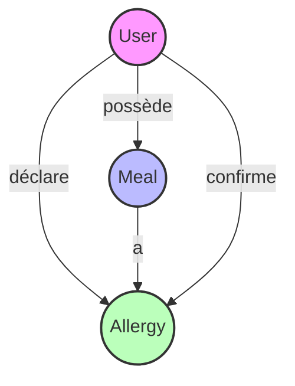

# MealTracker API

API de gestion des repas et allergies, permettant aux utilisateurs de suivre leurs repas et leurs réactions allergiques.

## Technologies utilisées

- Backend: Flask (Python)
- Base de données: PostgreSQL
- ORM: SQLAlchemy
- Conteneurs: Docker & Docker Compose
- Sécurité: Hashage des mots de passe
- Déploiement: Docker

## Schéma de la base de données



## Installation et Configuration

### Avec Docker

Pour les instructions détaillées sur l'installation avec Docker, voir [README_DOCKER.md](README_DOCKER.md).

### Installation locale

1. Créer un environnement virtuel Python

```bash
python -m venv venv
source venv/bin/activate  # Linux/Mac
```

2. Installer les dépendances

```bash
pip install -r requirements.txt
```

3. Configurer la base de données PostgreSQL

```bash
createdb flask_app
```

4. Lancer l'application

```bash
python app.py
```

## Fonctionnement de l'application

### Workflow utilisateur

1. Inscription
2. Connexion
3. Ajout de repas
4. Déclaration d'allergies
5. Suivi des réactions
6. Consultation des statistiques

### Logique des allergies

- Chaque déclaration d'allergie augmente le risque de 10%
- Une allergie est confirmée à 30% (3 déclarations)
- Les allergies confirmées sont suivies et affichées

## Endpoints disponibles

### Authentification

#### Inscription (Register)

```bash
# Créer un nouvel utilisateur
curl -X POST http://localhost:5000/register \
-H "Content-Type: application/json" \
-d '{"username": "Barthez", "email": "kenwoubarthez@gmail.com", "password": "password123"}'
```

#### Connexion (Login)

```bash
# Se connecter
curl -X POST http://localhost:5000/login \
-H "Content-Type: application/json" \
-d '{"username": "Barthez", "password": "password123"}'
```

#### Déconnexion (Logout)

```bash
# Se déconnecter
curl -X POST http://localhost:5000/logout
```

### Gestion des utilisateurs

#### Liste des utilisateurs

```bash
# Liste tous les utilisateurs
curl http://localhost:5000/users
```

#### Informations utilisateur

```bash
# Informations détaillées d'un utilisateur
curl http://localhost:5000/users/1
```

### Gestion des repas

#### Création d'un repas

```bash
# Créer un nouveau repas
curl -X POST http://localhost:5000/meals \
-H "Content-Type: application/json" \
-d '{"name": "Pizza", "ingredients": "Farine, fromage, tomates, jambon"}'
```

#### Liste des repas

```bash
# Liste tous les repas de l'utilisateur connecté
curl http://localhost:5000/meals
```

#### Mise à jour d'un repas

```bash
# Modifier un repas
curl -X PUT http://localhost:5000/meals/1 \
-H "Content-Type: application/json" \
-d '{"name": "Pizza Margherita", "ingredients": "Farine, mozzarella, tomates"}'
```

#### Suppression d'un repas

```bash
# Supprimer un repas
curl -X DELETE http://localhost:5000/meals/1
```

### Gestion des allergies

#### Déclaration d'allergie

```bash
# Déclarer une allergie sur un repas
curl -X POST http://localhost:5000/meals/1/allergy
```

#### Retrait d'une déclaration

```bash
# Retirer une déclaration d'allergie
curl -X DELETE http://localhost:5000/meals/1/allergy
```

## Sécurité

- Authentification requise pour toutes les opérations
- Hashage sécurisé des mots de passe
- Validation des entrées
- Protection contre les accès non autorisés

## Notes importantes

- Assurez-vous d'inclure tous les champs requis dans vos requêtes POST
- La connexion est requise pour accéder à la plupart des endpoints
- Les mots de passe sont stockés de manière sécurisée avec un hash
- Les données sont persistantes grâce à Docker volumes

## Support et contribution

Pour toute question ou problème, merci de créer un issue sur le repository.

## Tests avec Postman

Cette API est fournie avec une collection Postman prête à l'emploi pour faciliter les tests :

1. Ouvrez Postman
2. Cliquez sur l'icône d'import (flèche vers le bas)
3. Sélectionnez "Import from File"
4. Naviguez vers le fichier `Postman-API/Meal-Allergy-Management.postman_collection.json`
5. La collection sera importée avec tous les endpoints configurés

La collection inclut tous les endpoints de l'API avec des exemples de données pré-remplis pour faciliter les tests.

## Licence

Ce projet est sous licence MIT.

### 1. Inscription (Register)

- **URL**: `/register`
- **Méthode**: POST
- **Corps de la requête**:

```json
{
    "username": "votre_nom_utilisateur",
    "email": "votre_email@example.com",
    "password": "votre_mot_de_passe"
}
```

- **Réponse en cas de succès**:

```json
{
    "message": "User registered successfully",
    "user": {
        "id": 1,
        "username": "votre_nom_utilisateur",
        "email": "votre_email@example.com",
        "created_at": "2025-06-17T21:10:11+00:00"
    }
}
```

### 2. Créer un repas

- **URL**: `/meals`
- **Méthode**: POST
- **Nécessite d'être connecté**
- **Corps de la requête**:

```json
{
    "name": "Nom du repas",
    "ingredients": "Liste des ingrédients"
}
```

- **Réponse en cas de succès**:

```json
{
    "message": "Meal created successfully",
    "meal": {
        "id": 1,
        "name": "Nom du repas",
        "ingredients": "Liste des ingrédients",
        "created_at": "2025-06-17T21:10:11+00:00",
        "allergy_risk": 0
    }
}
```

### 3. Liste des repas

- **URL**: `/meals`
- **Méthode**: GET
- **Nécessite d'être connecté**
- **Réponse**:

```json
{
    "meals": [
        {
            "id": 1,
            "name": "Nom du repas",
            "ingredients": "Liste des ingrédients",
            "created_at": "2025-06-17T21:10:11+00:00",
            "allergy_risk": 0
        }
    ]
}
```

### 4. Mettre à jour un repas

- **URL**: `/meals/<id>`
- **Méthode**: PUT
- **Nécessite d'être connecté et propriétaire du repas**
- **Corps de la requête**:

```json
{
    "name": "Nouveau nom",
    "ingredients": "Nouvelle liste des ingrédients"
}
```

- **Réponse en cas de succès**:

```json
{
    "message": "Meal updated successfully",
    "meal": {
        "id": 1,
        "name": "Nouveau nom",
        "ingredients": "Nouvelle liste des ingrédients",
        "created_at": "2025-06-17T21:10:11+00:00",
        "allergy_risk": 0
    }
}
```

### 5. Supprimer un repas

- **URL**: `/meals/<id>`
- **Méthode**: DELETE
- **Nécessite d'être connecté et propriétaire du repas**
- **Réponse**:

```json
{
    "message": "Meal deleted successfully"
}
```

### 6. Déclarer une allergie

- **URL**: `/meals/<id>/allergy`
- **Méthode**: POST
- **Nécessite d'être connecté et propriétaire du repas**
- **Réponse**:

```json
{
    "message": "Allergy declared successfully",
    "meal": {
        "id": 1,
        "name": "Nom du repas",
        "ingredients": "Liste des ingrédients",
        "created_at": "2025-06-17T21:10:11+00:00",
        "allergy_risk": 10
    }
}
```

### 7. Retirer une déclaration d'allergie

- **URL**: `/meals/<id>/allergy`
- **Méthode**: DELETE
- **Nécessite d'être connecté et propriétaire du repas**
- **Réponse**:

```json
{
    "message": "Allergy declaration removed successfully",
    "meal": {
        "id": 1,
        "name": "Nom du repas",
        "ingredients": "Liste des ingrédients",
        "created_at": "2025-06-17T21:10:11+00:00",
        "allergy_risk": 0
    }
}

### 8. Consulter un utilisateur
- **URL**: `/users/<id>`
- **Méthode**: GET
- **Réponse**:
```json
{
    "user": {
        "id": 1,
        "username": "votre_nom_utilisateur",
        "email": "votre_email@example.com",
        "created_at": "2025-06-17T21:10:11+00:00",
        "confirmed_allergies": {
            "Nom du repas": {
                "ingredients": "Liste des ingrédients",
                "risk_percentage": 30
            }
        }
    }
}
```

### 2. Connexion (Login)

- **URL**: `/login`
- **Méthode**: POST
- **Corps de la requête**:

```json
{
    "username": "votre_nom_utilisateur",
    "password": "votre_mot_de_passe"
}
```

- **Réponse en cas de succès**:

```json
{
    "message": "Logged in successfully",
    "user": {
        "id": 1,
        "username": "votre_nom_utilisateur",
        "email": "votre_email@example.com"
    }
}
```

### 3. Déconnexion (Logout)

- **URL**: `/logout`
- **Méthode**: POST
- **Réponse**:

```json
{
    "message": "Logged out successfully"
}
```

### 4. Liste des utilisateurs

- **URL**: `/users`
- **Méthode**: GET
- **Nécessite d'être connecté**
- **Réponse**:

```json
{
    "users": [
        {
            "id": 1,
            "username": "votre_nom_utilisateur",
            "email": "votre_email@example.com",
            "created_at": "2025-06-17T21:10:11+00:00"
        }
    ]
}
```

### 5. Modifier un utilisateur

- **URL**: `/user/<id>`
- **Méthode**: PUT
- **Nécessite d'être connecté**
- **Nécessite d'être l'utilisateur en question**
- **Corps de la requête**:

```json
{
    "username": "nouveau_nom_utilisateur",
    "email": "nouvel_email@example.com",
    "password": "nouveau_mot_de_passe"
}
```

- **Note**: Vous pouvez mettre à jour un ou plusieurs champs en même temps
- **Réponse en cas de succès**:

```json
{
    "message": "User updated successfully",
    "user": {
        "id": 1,
        "username": "nouveau_nom_utilisateur",
        "email": "nouvel_email@example.com",
        "created_at": "2025-06-17T21:10:11+00:00"
    }
}
```

### 6. Supprimer un utilisateur

- **URL**: `/user/<id>`
- **Méthode**: DELETE
- **Nécessite d'être connecté**
- **Nécessite d'être l'utilisateur en question**
- **Réponse**:

```json
{
    "message": "User deleted successfully"
}
```

- **Note**: Vous serez automatiquement déconnecté après la suppression

### 7. Supprimer tous les utilisateurs

- **URL**: `/users/delete-all`
- **Méthode**: DELETE
- **Nécessite d'être connecté**
- **Réponse**:

```json
{
    "message": "All users except current user deleted successfully"
}
```

- **Note**: Supprime tous les utilisateurs sauf celui qui fait la requête

### 1. Inscription (Register)

- **URL**: `/register`
- **Méthode**: POST
- **Corps de la requête**:

```json
{
    "username": "votre_nom_utilisateur",
    "email": "votre_email@example.com",
    "password": "votre_mot_de_passe"
}
```

- **Réponse en cas de succès**:

```json
{
    "message": "User registered successfully",
    "user": {
        "id": 1,
        "username": "votre_nom_utilisateur",
        "email": "votre_email@example.com",
        "created_at": "2025-06-17T21:10:11+00:00"
    }
}
```

### 2. Connexion (Login)

- **URL**: `/login`
- **Méthode**: POST
- **Corps de la requête**:

```json
{
    "username": "votre_nom_utilisateur",
    "password": "votre_mot_de_passe"
}
```

- **Réponse en cas de succès**:

```json
{
    "message": "Logged in successfully",
    "user": {
        "id": 1,
        "username": "votre_nom_utilisateur",
        "email": "votre_email@example.com"
    }
}
```

### 3. Déconnexion (Logout)

- **URL**: `/logout`
- **Méthode**: POST
- **Réponse**:

```json
{
    "message": "Logged out successfully"
}
```

### 4. Liste des utilisateurs

- **URL**: `/users`
- **Méthode**: GET
- **Nécessite d'être connecté**
- **Réponse**:

```json
{
    "users": [
        {
            "id": 1,
            "username": "votre_nom_utilisateur",
            "email": "votre_email@example.com",
            "created_at": "2025-06-17T21:10:11+00:00"
        }
    ]
}
```

## Exemples d'utilisation avec curl

### Inscription

```bash
curl -X POST http://localhost:5000/register \
-H "Content-Type: application/json" \
-d '{"username": "Barthez", "email": "kenwoubarthez@gmail.com", "password": "password123"}'
```

### Connexion

```bash
curl -X POST http://localhost:5000/login \
-H "Content-Type: application/json" \
-d '{"username": "Barthez", "password": "password123"}'
```

### Liste des utilisateurs

```bash
curl http://localhost:5000/users
```

## Notes

- Assurez-vous d'inclure tous les champs requis dans vos requêtes POST
- La connexion est requise pour accéder à l'endpoint `/users`
- Les mots de passe sont stockés de manière sécurisée avec un hash
